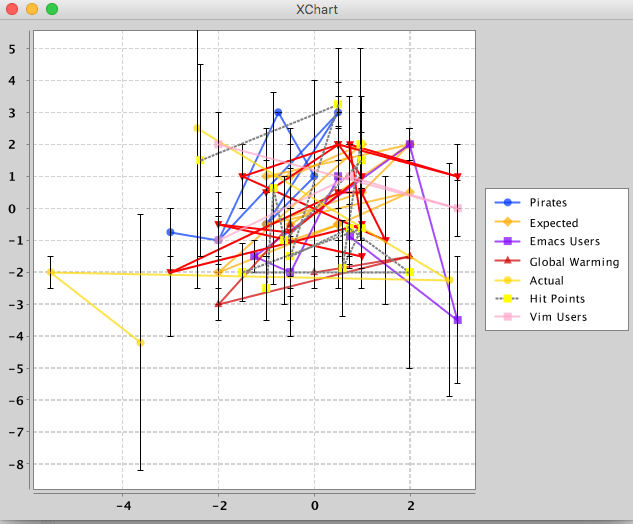

# Experiments with specing clj-xchart.

This is *not* the current/official/blessed clj-xchart. That can be found at https://hypirion.github.io/clj-xchart/.

## Random charts cannot be trusted

Vim users are not really implicated in global warming (yet).

## License

Copyright © 2016 Jean Niklas L'orange

Distributed under the Eclipse Public License either version 1.0 or (at
your option) any later version.
